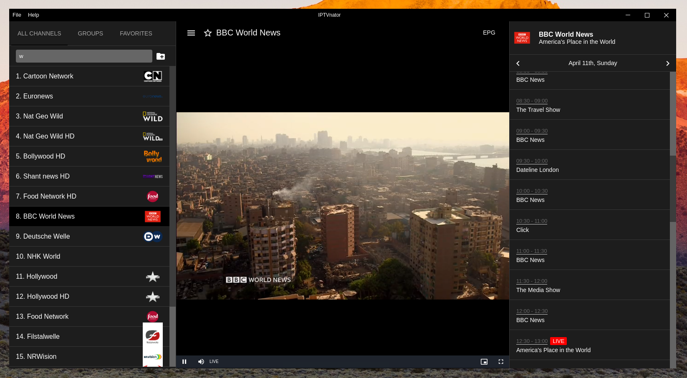
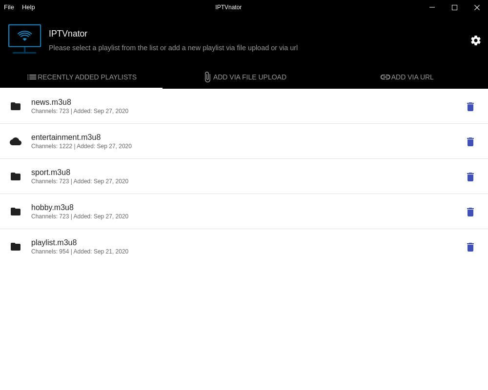
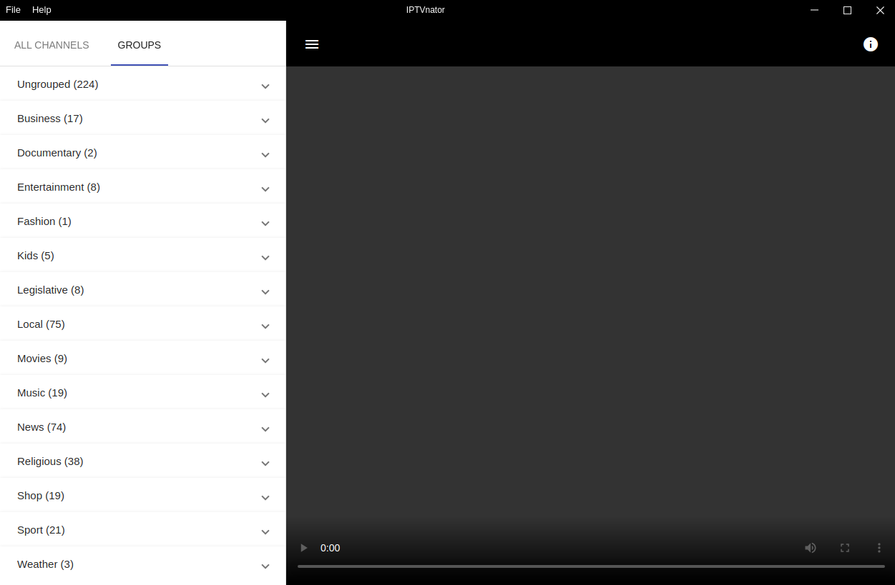
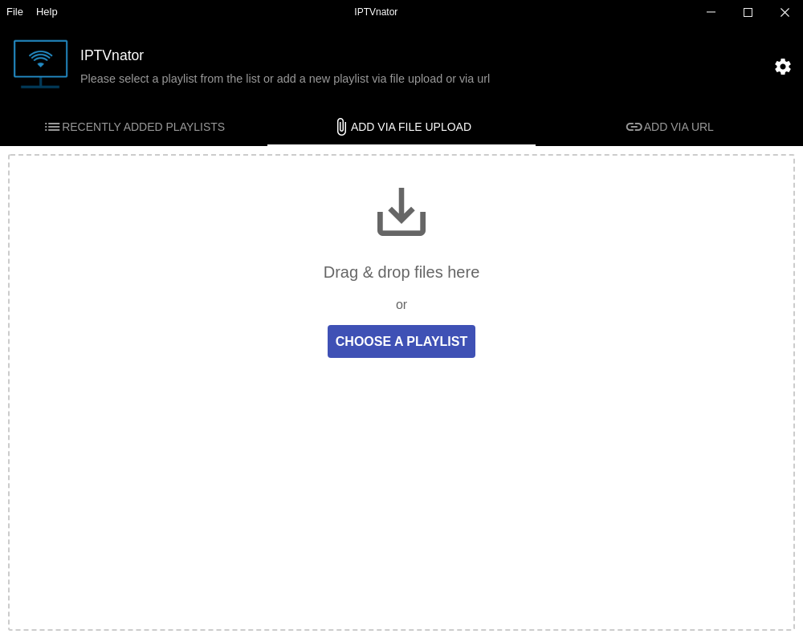
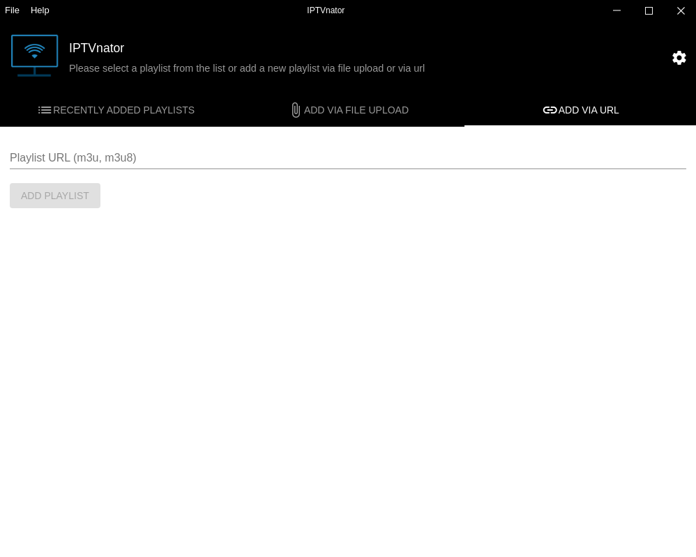
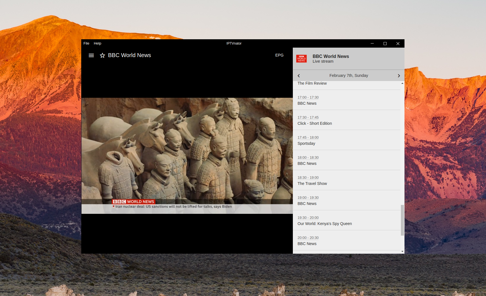
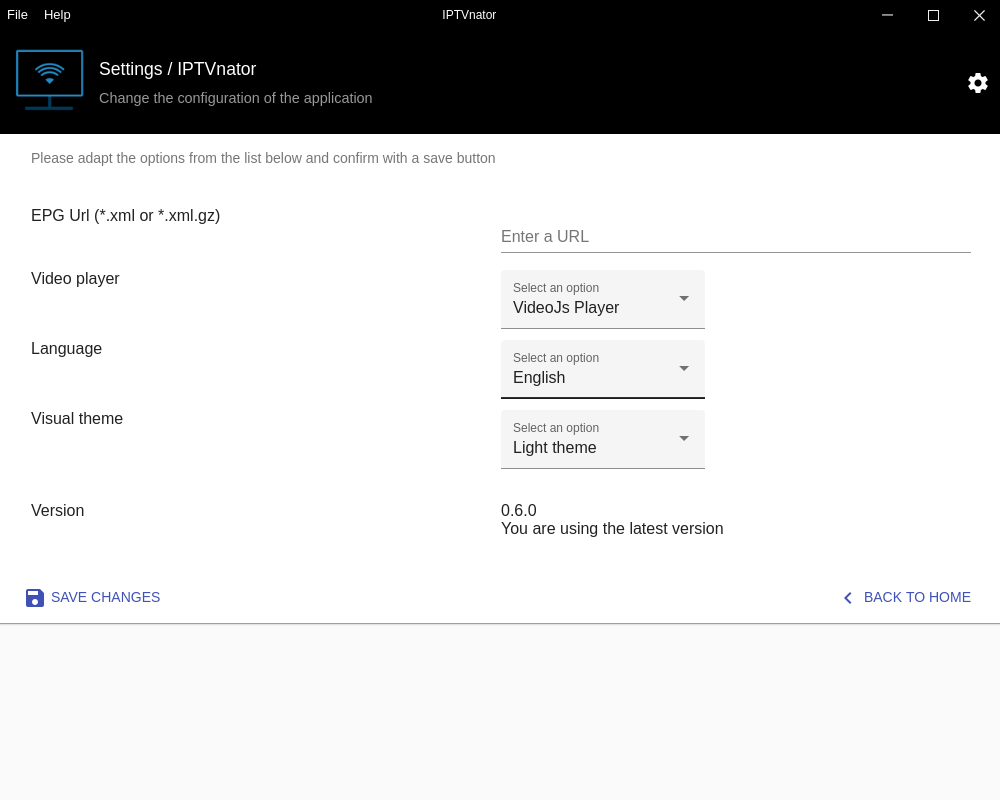
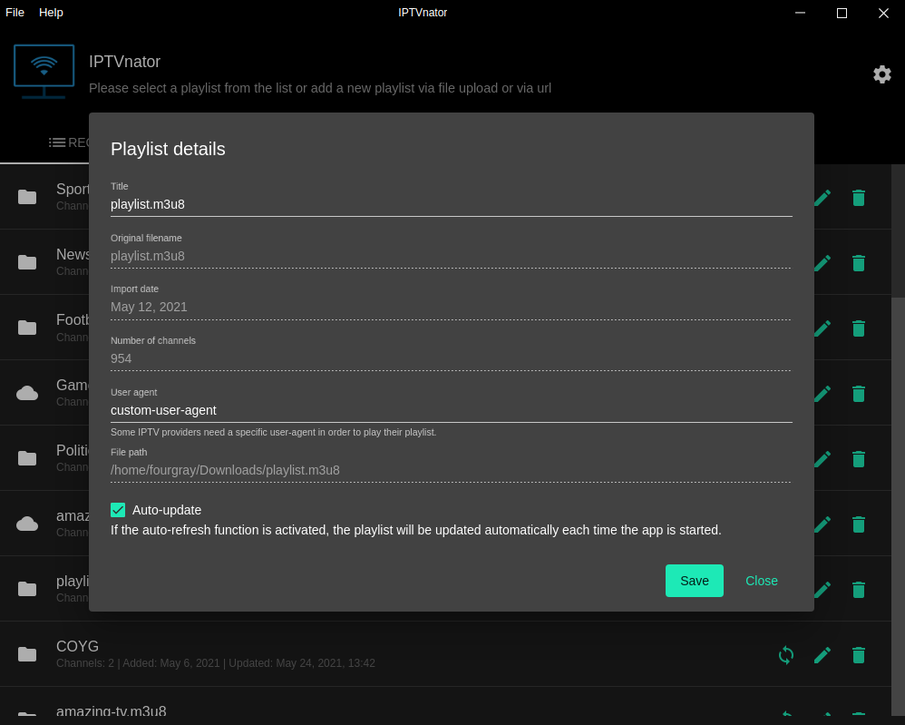

# IPTVmate - IPTV Player Application

<p align="center">
  
</p>
<p align="center">
  <a href="https://github.com/4gray/iptvmate/releases"></a>
  <a href="https://github.com/4gray/iptvmate/releases"></a>
  <a href="https://github.com/4gray/iptvmate/releases"></a> <a href="https://codecov.io/gh/4gray/iptvmate"></a> <a href="https://t.me/iptvmate"></a> <a href="https://bsky.app/profile/iptvmate.bsky.social"></a>
</p>

🌐 **[Website](https://4gray.github.io/iptvmate/)** | <a href="https://t.me/iptvmate">Telegram channel for discussions</a> | <a href="https://ko-fi.com/4gray" target="_blank">Buy me a coffee</a> | <a href="https://github.com/sponsors/4gray">GitHub Sponsors</a>

**iptvmate** is a video player application that provides support for IPTV playlist playback (m3u, m3u8). The application allows users to import playlists using remote URLs or by uploading files from the local file system. Additionally, it supports EPG information in XMLTV format which can be provided via URL.

The application is a cross-platform, open-source project built with Electron and Angular.

⚠️ Note: iptvmate does not provide any playlists or other digital content. The channels and pictures in the screenshots are for demonstration purposes only.



## Features

-   M3u and M3u8 playlist support 📺
-   Xtream Code (XC) and Stalker portal (STB) support
-   External player support - MPV, VLC
-   Add playlists from the file system or remote URLs 📂
-   Automatic playlist updates on application startup
-   Channel search functionality 🔍
-   EPG support (TV Guide) with detailed information
-   TV archive/catchup/timeshift functionality
-   Group-based channel list
-   Favorite channels management
-   Global favorites aggregated from all playlists
-   HTML video player with HLS.js support or Video.js-based player
-   Internationalization with support for 16 languages:
    * Arabic
    * Moroccan arabic
    * English
    * Russian
    * German
    * Korean
    * Spanish
    * Chinese
    * Traditional chinese
    * French
    * Italian
    * Turkish
    * Japanese
    * Dutch
    * Belarusian
    * Polish  
-   Custom "User Agent" header configuration for playlists
-   Light and Dark themes
-   Docker version available for self-hosting

## Screenshots:

|                 Welcome screen: Playlists overview                 | Main player interface with channels sidebar and video player  |
| :----------------------------------------------------------------: | :-----------------------------------------------------------: |
|              |      |
|            Welcome screen: Add playlist via file upload            |             Welcome screen: Add playlist via URL              |
|  |  |
|              EPG Sidebar: TV guide on the right side               |                 General application settings                  |
|                  |                   |
|                         Playlist settings                          |
|                  |                                                               |

_Note: First version of the application which was developed as a PWA is available in an extra git branch._

## Download

Download the latest version of the application for macOS, Windows, and Linux from the [release page](https://github.com/4gray/iptvmate/releases).

Alternatively, you can install the application using one of the following package managers:

### Homebrew

```shell
$ brew install iptvmate
```

### Snap

```shell
$ sudo snap install iptvmate
```

### Arch

Also available as an Arch PKG, [iptvmate-bin](https://aur.archlinux.org/packages/iptvmate-bin/), in the AUR (using your favourite AUR-helper, .e.g. `yay`)

```shell
$ yay -S iptvmate-bin
```

### Gentoo

You can install iptvmate from the [gentoo-zh overlay](https://github.com/microcai/gentoo-zh)

```shell
sudo eselect repository enable gentoo-zh
sudo emerge --sync gentoo-zh
sudo emerge iptvmate-bin
```

[](https://snapcraft.io/iptvmate)

<a href="https://github.com/sponsors/4gray" target="_blank"></a>

## Troubleshooting

### macOS: "App is damaged and can't be opened"

Due to Apple's Gatekeeper security and code signing requirements, you may need to remove the quarantine flag from the downloaded application:

```bash
xattr -c /Applications/iptvmate.app
```

Alternatively, if the app is located in a different directory:

```bash
xattr -c ~/Downloads/iptvmate.app
```

### Linux: chrome-sandbox Issues

If you encounter the following error when launching iptvmate:

```
The SUID sandbox helper binary was found, but is not configured correctly.
Rather than run without sandboxing I'm aborting now.
You need to make sure that chrome-sandbox is owned by root and has mode 4755.
```

**Solution 1: Fix chrome-sandbox permissions (Recommended for .deb/.rpm installations)**

Navigate to the iptvmate installation directory and run:

```bash
sudo chown root:root chrome-sandbox
sudo chmod 4755 chrome-sandbox
```

**Solution 2: Launch with --no-sandbox flag**

Edit the desktop launcher file to add the `--no-sandbox` flag:

1. Find your desktop file location:
   - **Ubuntu/Debian**: `~/.local/share/applications/iptvmate.desktop`
   - **System-wide**: `/usr/share/applications/iptvmate.desktop`

2. Edit the file and modify the `Exec` line:

   ```
   Exec=iptvmate --no-sandbox %U
   ```

3. Save the file and relaunch the application from your application menu.

Alternatively, you can launch iptvmate from the terminal with the flag:

```bash
iptvmate --no-sandbox
```

## How to Build and Develop

Requirements:

-   Node.js with npm

1. Clone this repository and install project dependencies:

    ```
    $ npm install
    ```

2. Start the application:
    ```
    $ npm run serve:backend
    ```

This will open the Electron app in a separate window, while the Angular dev server will run at http://localhost:4200.

To run only the Angular app without Electron, use:

```
$ npm run serve:frontend
```

## Disclaimer

**iptvmate doesn't provide any playlists or other digital content.**

<!-- ALL-CONTRIBUTORS-BADGE:START - Do not remove or modify this section -->

[](#contributors)

<!-- ALL-CONTRIBUTORS-BADGE:END -->
